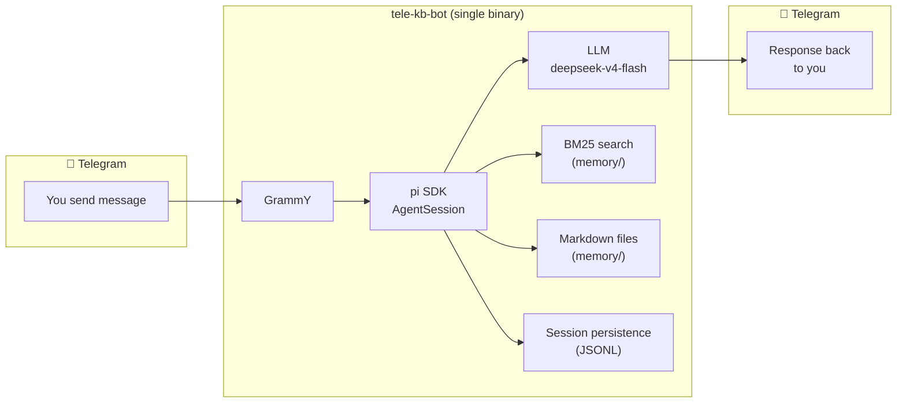

<p align="center">
  <picture>
    <source media="(prefers-color-scheme: dark)" srcset="https://img.shields.io/badge/tele‑kb‑bot-8B5CF6?style=for-the-badge&logo=telegram&logoColor=white&labelColor=1F2937">
    
  </picture>
</p>

<p align="center">
  <strong>Chat with an LLM from your phone. Search a local knowledge base. All in a single binary.</strong>
</p>

<p align="center">
  <a href="#-quick-start"><b>Quick Start</b></a> ·
  <a href="#-commands"><b>Commands</b></a> ·
  <a href="#-configuration"><b>Configuration</b></a> ·
  <a href="#-architecture"><b>Architecture</b></a> ·
  <a href="#-docs"><b>Docs</b></a>
</p>

<p align="center">
  <a href="https://github.com/faizhasim/tele-kb-bot/actions"></a>
  <a href="https://github.com/faizhasim/tele-kb-bot/releases"></a>
  <a href="https://bun.sh"></a>
  <a href="https://effect.website"></a>
  <a href="https://brew.sh"></a>
</p>

---

## 🚀 Quick Start

```bash
brew tap faizhasim/tele-kb-bot
brew install tele-kb-bot
tele-kb-bot setup
```

Three commands. That's it.

The `setup` wizard walks you through connecting your Telegram bot and configuring your LLM. After that, your bot is ready — just `tele-kb-bot start` to run it.

> [!TIP]
> Want to skip the wizard? Set `TELEGRAM_BOT_TOKEN` and run `tele-kb-bot setup --non-interactive`. See [Configuration](docs/configuration.md).

---

## ✨ What It Does

| Feature | Description |
|---------|-------------|
| **💬 Chat from your phone** | Send messages, photos, documents, voice notes — the bot processes them via an LLM |
| **🧠 Persistent memory** | Conversations and facts stored as plain markdown, searchable via BM25 |
| **🔒 Private & secure** | Runs on your own machine. Zero secrets in the binary. User whitelist enforced. |
| **📦 Single binary** | Built with `bun build --compile` — no Node.js, no npm, no runtime needed |
| **🔄 Auto-restart** | launchd integration keeps it alive across reboots and crashes |
| **🖥️ Multi-platform** | macOS, Linux, and Windows builds via GoReleaser |

---

## 📟 Commands

| Command | Description |
|---------|-------------|
| `tele-kb-bot setup` | Interactive first-run configuration wizard |
| `tele-kb-bot start` | Run the daemon in the foreground |
| `tele-kb-bot status` | Show config health, bot info, and version |
| `tele-kb-bot install-launchd` | Create and load a launchd plist for auto-start |
| `tele-kb-bot version` | Print version and exit |
| `tele-kb-bot help` | Print full usage information |

---

## ⚙️ Configuration

Config lives in `~/.config/tele-kb-bot/config.yaml` (override with `TELE_KB_BOT_CONFIG`).

### Environment Variables

| Variable | Purpose |
|----------|---------|
| `TELEGRAM_BOT_TOKEN` | Bot token from @BotFather |
| `TELEGRAM_ALLOWED_USER_IDS` | Comma-separated Telegram user IDs |
| `OPENER_GO_API_KEY` | LLM provider API key |
| `LOG_LEVEL` | `fatal` \| `error` \| `warn` \| `info` \| `debug` \| `trace` |

> [!NOTE]
> The compiled binary contains **zero secrets**. All credentials are read from disk at runtime. See the [security model](docs/configuration.md#security).

---

## 🏗️ Architecture



| Layer | Stack |
|-------|-------|
| **Runtime** | [Bun](https://bun.sh) — single binary via `bun build --compile` |
| **Functional core** | [Effect TS](https://effect.website) — composable effects, tagged errors, services |
| **Telegram** | [GrammY](https://grammy.dev) — long-polling bot framework |
| **AI** | [pi SDK](https://github.com/mariozechner/pi) — per-chat agent sessions |
| **LLM** | Opencode Go / deepseek-v4-flash with high reasoning |
| **Search** | Pure-TypeScript BM25 (zero external deps) |
| **Logging** | [pino](https://getpino.io) — structured JSON logging |
| **Packaging** | [GoReleaser](https://goreleaser.com) — cross-platform builds + Homebrew |

### Project Structure

```
src/
├── index.ts              # Entry point
├── constants.ts          # Shared constants
├── logger.ts             # EffectLogger service + pino
├── cli/                  # CLI commands (setup, start, status, install-launchd, help)
├── config/               # Schema (Effect Schema), loader, paths, defaults
├── daemon/               # Bot controller, session registry, main
├── memory/               # Scratchpad, BM25 search, context builder, manager
├── pi/                   # pi SDK provider, extensions, session factory
└── telegram/             # Client, handler, media, streaming, chunking
```

---

## 📚 Docs

| Guide | What it covers |
|-------|----------------|
| [Setup Guide](docs/setup.md) | Creating a bot, running setup, troubleshooting |
| [Configuration](docs/configuration.md) | Full config schema, env vars, security model |
| [Deployment](docs/deployment.md) | Launching on a machine with launchd |
| [Nix Guide](docs/nix-guide.md) | Declarative config with home-manager and sops-nix |
| [Development](docs/development.md) | Building from source, testing, releasing |

---

## 🚢 Releases

One click in GitHub Actions:

1. Go to **Actions** → **CI** workflow → **Run workflow**
2. Enter the version number (e.g., `0.1.1`)
3. Pipeline builds for macOS, Linux, Windows — creates a GitHub Release and updates the Homebrew formula.

For full details, see the [Development Guide](docs/development.md#release-process).

---

<p align="center">
  <sub>Built with <a href="https://effect.website">Effect</a>, <a href="https://bun.sh">Bun</a>, and ☕</sub>
</p>

<p align="center">
  <sub><em>Entirely generated by <a href="https://github.com/mariozechner/pi">pi</a> running on <strong>deepseek-v4-flash</strong> with high reasoning — because the best way to build a bot is to let the bots handle the boilerplate while the human steers. Hat tip to <a href="https://github.com/faizhasim">Mohd Faiz Hasim</a> for knowing exactly when to say "no, do it this way." 🎯</em></sub>
</p>
