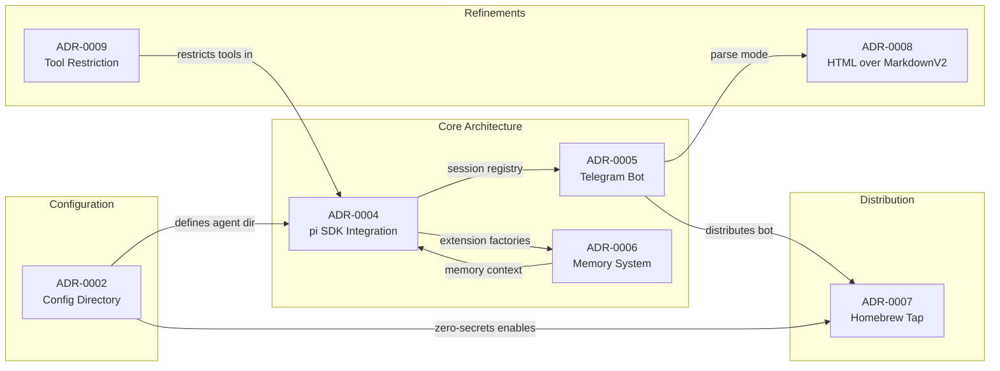

# ADRs (Architecture Decision Records)

This directory contains all Architecture Decision Records (ADRs) for tele-kb-bot, following the [MADR](https://adr.github.io/madr/) format.

Each ADR documents a significant architectural decision — the context, alternatives considered, rationale, and consequences.

## Index

| ADR | Title | Status | Date |
|-----|-------|--------|------|
| [0001](0001-use-architectural-decision-records.md) | Use Markdown Architectural Decision Records (MADR) | Accepted | 2026-05-21 |
| [0002](0002-config-directory-and-schema.md) | Config Directory Location and Schema | Accepted | 2026-05-21 |
| [0003](0003-cli-command-structure.md) | CLI Command Structure and Design | Accepted | 2026-05-21 |
| [0004](0004-pi-sdk-integration.md) | pi SDK Integration Architecture | Accepted | 2026-05-21 |
| [0005](0005-telegram-bot-design.md) | Telegram Bot Design and Message Flow | Accepted | 2026-05-21 |
| [0006](0006-memory-system-design.md) | Memory System Design | Accepted | 2026-05-21 |
| [0007](0007-distribution-strategy-homebrew.md) | Distribution Strategy — Homebrew Tap | Accepted | 2026-05-21 |
| [0008](0008-use-html-over-markdownv2.md) | Use HTML parse_mode over MarkdownV2 for Telegram Messages | Accepted | 2026-05-21 |
| [0009](0009-tool-surface-restriction.md) | Agent Tool Surface Restriction | Accepted | 2026-05-23 |

## Decision Graph

## Reading Order

New to the project? Read the ADRs in this order:

1. **[ADR-0001](0001-use-architectural-decision-records.md)** — Why we write ADRs in the first place
2. **[ADR-0002](0002-config-directory-and-schema.md)** — The foundation: config location, YAML schema, zero-secrets
3. **[ADR-0004](0004-pi-sdk-integration.md)** — How the pi SDK is wired in (the architectural core)
4. **[ADR-0005](0005-telegram-bot-design.md)** — Telegram integration design and message flow
5. **[ADR-0006](0006-memory-system-design.md)** — How memory and search work
6. **[ADR-0007](0007-distribution-strategy-homebrew.md)** — Why Homebrew, how releases work
7. Rest in any order
