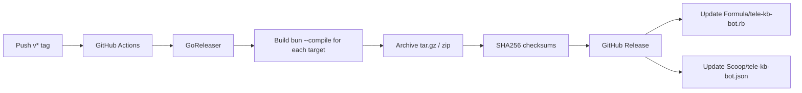

# Homebrew Strategy

The tele-kb-bot binary is distributed via a [Homebrew tap](https://docs.brew.sh/Taps) hosted in the same repository (`faizhasim/tele-kb-bot`). This document explains why Homebrew was chosen, the release pipeline, and the user installation flow.

## Why Homebrew

Homebrew was chosen as the primary distribution mechanism for several reasons:

**macOS-native.** Homebrew is the de-facto package manager for macOS. Every macOS developer has it installed and knows how to use `brew install`. Unlike npm, pip, or gem, Homebrew does not require a language runtime — the binary is self-contained.

**`brew upgrade` integration.** Once installed, the bot receives automatic updates via `brew upgrade`. Users do not need to manually check for new versions, download tarballs, or re-run install scripts. Homebrew's formula tracks the latest GitHub Release, and `brew upgrade` pulls the new binary.

**SHA256 verification.** Every Homebrew formula includes a SHA256 checksum of the binary archive. Homebrew verifies this checksum before extracting the binary, providing integrity guarantees that curl-pipe-bash or manual downloads lack.

**GoReleaser automation.** The release pipeline uses GoReleaser, which builds all platform targets, creates archives and checksums, generates the GitHub Release, and auto-updates the Homebrew formula with the correct SHA256 values. No manual formula editing needed.

**Multi-platform support.** The same Homebrew tap works on macOS (arm64, amd64) and Linux (arm64, amd64). Windows users install via Scoop from the same GoReleaser-generated manifest.

**Zero secrets.** The binary contains no API keys or secrets — they are configured at runtime via `tele-kb-bot setup`. This makes the binary publishable to a public Homebrew tap without security concerns.

## Alternatives Considered

| Option | Pros | Cons |
|--------|------|------|
| **Homebrew tap** | One-command install/update, SHA256 verification, GoReleaser automation, macOS-native | Requires GitHub-managed formula updates, large binary uploads |
| **npm** | Familiar to JS developers, simple install | Requires Node.js runtime, not macOS-native, launchd integration non-standard |
| **curl-pipe-bash** | Simplest distribution, no package manager needed | Anti-pattern for security (no integrity verification), no automatic updates, manual binary management |
| **Mac App Store** | Official macOS distribution channel | Requires sandboxing (incompatible with bash execution, filesystem access), App Store review delays releases, Telegram API network access justification needed |
| **Manual download** | User has full control over version and location | No update mechanism, manual steps to download, extract, and place in PATH |

### Why not npm

npm requires Node.js to be installed. tele-kb-bot is a compiled binary — it does not need or use a Node.js runtime at runtime. Requiring npm (and thus Node.js) as a prerequisite would add unnecessary friction for users. Furthermore, launchd integration is non-standard with npm-based tools, and the binary still needs to be distributed outside the npm package.

### Why not curl-pipe-bash

curl-pipe-bash is the simplest possible distribution mechanism, but it has no integrity verification. Users pipe a script from a URL without checking what it does or whether it was tampered with. There is no automatic update mechanism — users must re-run the script manually. The binary location, permissions, and PATH management are left to the user.

### Why not the Mac App Store

The Mac App Store requires sandboxing, which is incompatible with tele-kb-bot's core operations: executing shell commands (qmd, launchctl), accessing arbitrary filesystem paths (Obsidian vaults, config directories), and making network calls to the Telegram API and LLM providers. Additionally, the App Store review process would delay every release, and justifying the Telegram API network access would require special entitlements.

### Why not manual download

Manual download from GitHub Releases works but has no update mechanism. Users must periodically check for new versions, download the correct tarball for their architecture, extract it, and place the binary in their PATH. This is error-prone and inconvenient.

## Release Pipeline

Releases are triggered via GitHub Actions (one-click `workflow_dispatch` or `v*` tag push).



GoReleaser handles the following in sequence:

1. **Build** — Runs `bun build --compile` for each target platform and architecture (`darwin-arm64`, `darwin-x64`, `linux-arm64`, `linux-x64-modern`, `windows-x64-modern`).
2. **Archive** — Packs each binary into `.tar.gz` (macOS, Linux) or `.zip` (Windows).
3. **Checksum** — Generates SHA256 checksums for every archive.
4. **GitHub Release** — Creates a release on GitHub with all archives and checksum files attached.
5. **Formula update** — Writes the Homebrew formula to `Formula/tele-kb-bot.rb` with the correct SHA256 values, version, and download URLs.
6. **Scoop manifest** — Writes the Windows Scoop manifest to `Scoop/tele-kb-bot.json`.

The pipeline runs on `macos-latest` in GitHub Actions. All targets are cross-compiled by Bun's `--target` flag — no separate build machines are needed.

A detailed architectural description of the distribution strategy is available in [ADR-0007](adrs/0007-distribution-strategy-homebrew.md), including the decision drivers, trade-offs evaluated, and confirmed outcomes.

## Platform Support

| Platform | Architectures | Package Manager |
|----------|---------------|-----------------|
| macOS    | arm64, amd64  | Homebrew        |
| Linux    | arm64, amd64  | Homebrew        |
| Windows  | amd64         | Scoop           |

The compiled binary is approximately 40-70 MB depending on platform and architecture. This includes the Bun runtime, pi SDK, grammY, Effect, and application code — typical for Bun-compiled binaries.

## User Installation Flow

```bash
brew tap faizhasim/tele-kb-bot https://github.com/faizhasim/tele-kb-bot.git
brew install tele-kb-bot
tele-kb-bot setup
tele-kb-bot install
```

1. **`brew tap`** — Adds the repository as a Homebrew tap, making the formula available.
2. **`brew install`** — Downloads the correct binary archive for the user's architecture, verifies the SHA256 checksum, and places the binary in the Homebrew prefix.
3. **`tele-kb-bot setup`** — Runs the interactive setup wizard, writing the config file and storing API credentials.
4. **`tele-kb-bot install`** — Installs and loads the launchd plist for background operation.

After installation, the bot runs as a launchd service and restarts automatically on login or system boot. The binary path is managed by Homebrew — `brew upgrade tele-kb-bot` updates the binary while preserving the config and credential files.
