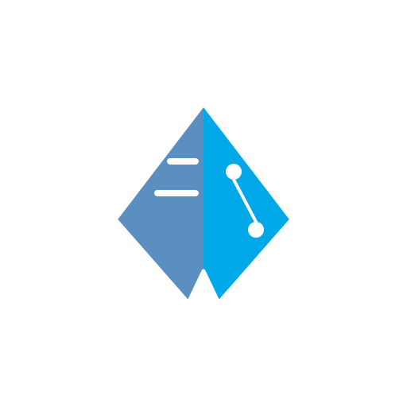
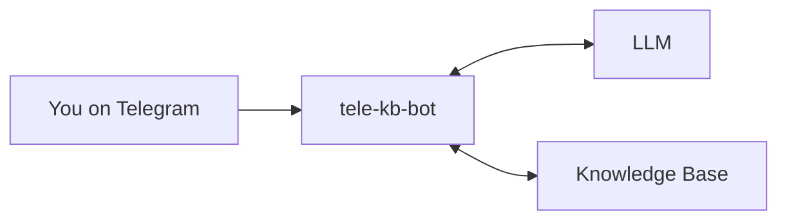

<p align="center">
  
</p>

# tele-kb-bot

**Chat with an LLM from your phone. Search a local knowledge base. All in a single binary.**

[](https://github.com/faizhasim/tele-kb-bot/actions)
[](https://github.com/faizhasim/tele-kb-bot/releases)
[](https://brew.sh)

---

## Quick Start

```bash
brew tap faizhasim/tele-kb-bot https://github.com/faizhasim/tele-kb-bot.git
brew install tele-kb-bot
tele-kb-bot setup
```

Three commands. After setup, run `tele-kb-bot start` and message your bot on Telegram.

!!! tip "Prefer non-interactive?"
    Set `TELEGRAM_BOT_TOKEN=xxx` and run `tele-kb-bot setup --non-interactive`.

---

## What You Get

- **Chat from your phone** — send messages, photos, documents, voice notes. The bot processes them via an LLM and replies on Telegram.
- **Persistent memory** — conversations and facts stored as plain markdown files, searchable across sessions.
- **Private & secure** — runs on your own machine. Zero secrets in the binary. User whitelist enforced.
- **Single binary** — no Node.js, no Python, no runtime to install. Just a compiled binary.
- **Auto-restart** — launchd keeps it alive across reboots and crashes.
- **Multi-platform** — macOS, Linux, and Windows.

---

## How It Works



A Telegram bot receives your messages, passes them to an LLM with context from a local knowledge base, and sends the response back. The bot, LLM client, and memory search are packed into a single binary.

---

## Next Steps

<div class="grid cards" markdown>

-   __Getting Started__

    Get tele-kb-bot running in under a minute.

    [:octicons-arrow-right-24: Quick Start](getting-started/quick-start.md)
    [:octicons-arrow-right-24: Setup Guide](getting-started/setup.md)

-   __How-to Guides__

    Deploy 24/7, build from source, configure with Nix.

    [:octicons-arrow-right-24: How-to Guides](how-to/index.md)

-   __Reference__

    CLI commands, config schema, architecture overview.

    [:octicons-arrow-right-24: Reference](reference/index.md)

-   __Design Decisions__

    Why certain choices were made — documented as ADRs.

    [:octicons-arrow-right-24: Explanation](explanation/index.md)

</div>
