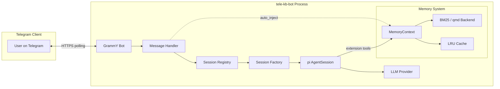

# Architecture

tele-kb-bot is a standalone Telegram bot powered by the pi coding agent SDK. It connects a Telegram bot (via GrammY) to an LLM-based agent session, with a configurable memory/knowledge base system for context retrieval. The bot enforces a read-only security model — the agent can search and read knowledge but has no shell or filesystem write access.

## System Overview

The bot receives messages from Telegram through GrammY long-polling. Each message is checked against the allowed user whitelist and routed to a per-chat `AgentSession` managed by the session registry. Sessions are created lazily, evicted after 30 minutes of inactivity, and capped by a configurable pool limit.

Memory context is injected into prompts when `memory.auto_inject` is enabled. The agent can also interact directly with the memory system through five compiled-in extension tools.

## Layer Table

| Layer          | Module(s)                  | Responsibility                                          |
|----------------|----------------------------|---------------------------------------------------------|
| **CLI**        | `src/cli/`                 | Argument parsing, command dispatch, setup wizard        |
| **Config**     | `src/config/`              | YAML loading, schema validation, env var overrides      |
| **Bot**        | `src/daemon/bot.ts`        | GrammY bot controller, typing indicators, chunked sends |
| **Handler**    | `src/daemon/session-registry.ts` | Per-chat session management, pool limit, idle eviction |
| **Session**    | `src/pi/session-factory.ts`| pi SDK `AgentSession` creation, auth/model wiring       |
| **Extensions** | `src/pi/extensions.ts`     | Compiled-in agent tools (memory, scratchpad, attach)    |
| **Memory**     | `src/memory/`              | BM25/qmd backends, LRU cache, context builder           |
| **Logging**    | `src/logger.ts`            | Pino-based structured logging, file rotation            |

## How Messages Flow

When a user sends a message, the bot checks it against the allowed-user whitelist. If the user is not authorised, the message is silently ignored. For authorised users, the session registry finds or creates a per-chat `AgentSession`. If memory auto-injection is enabled, relevant context is retrieved from the knowledge base and prepended to the prompt. The session sends the full message to the LLM, which may invoke compiled-in extension tools (memory search, scratchpad, etc.) during its turn. The full response is collected once the agent finishes, split into Telegram-sized chunks, and delivered to the user. A typing indicator is shown while the agent is thinking.

## Want to dig deeper?

The architecture decisions behind each subsystem are documented in the Design Decisions section:

- [ADR-0004: pi SDK Integration](../explanation/design-decisions/0004-pi-sdk-integration.md) — session factory, agent lifecycle
- [ADR-0005: Telegram Bot Design](../explanation/design-decisions/0005-telegram-bot-design.md) — message handling, typing indicators, chunking
- [ADR-0006: Memory System Design](../explanation/design-decisions/0006-memory-system-design.md) — BM25/qmd backends, context injection
- [ADR-0009: Tool Surface Restriction](../explanation/design-decisions/0009-tool-surface-restriction.md) — read-only security model
